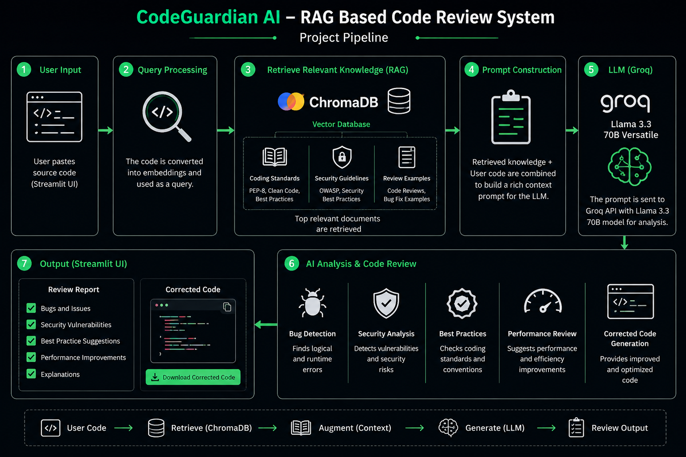

<h1 align="center">🚀 CodeGuardian AI</h1>

<h3 align="center">
RAG-Based AI Code Reviewer for Context-Aware Bug Detection and Code Improvement
</h3>

CodeGuardian AI is a RAG (Retrieval-Augmented Generation) based AI Code Reviewer that analyzes source code, identifies bugs, explains issues, suggests improvements, and generates corrected code using a Large Language Model (LLM).
Unlike a normal AI chatbot, CodeGuardian AI first retrieves relevant coding standards, security guidelines, and review examples from a knowledge base before generating a review. This makes the feedback more accurate, context-aware, and aligned with software engineering best practices.

# **Problem Statement**

Developers often spend significant time reviewing code for:
Bugs and logical errors
Security vulnerabilities
Poor coding practices
Performance issues
Code maintainability

Manual code reviews can be time-consuming and inconsistent.

CodeGuardian AI automates this process using RAG and LLMs to provide intelligent and context-aware code reviews.

# **Technologies Used:**

      Frontend
      Streamlit
        
#**Backend:**
      Python
      
**Vector Database:**
      ChromaDB
      
**LLM:**
    Groq API
    Llama 3.3 70B Versatile
    
**Knowledge Base:**
    Coding Standards
    Security Guidelines
    Review Examples

    
#**AI Technique:**
    Retrieval-Augmented Generation (RAG)

## Project Pipeline

